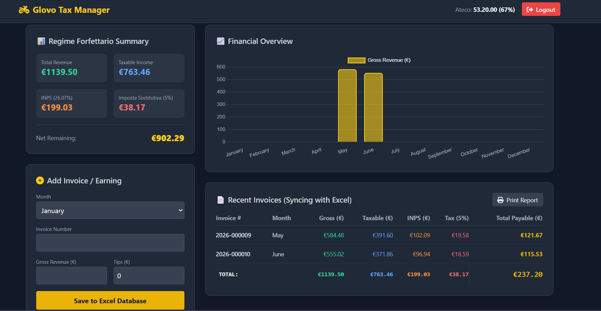

# Glovo Rider - Regime Forfettario Tax Manager 🚴‍♂️📊

An automated financial dashboard and tax tracker specifically designed for Glovo riders in Italy operating under the **Regime Forfettario** tax system (based on the ATECO 53.20.00 code with a 67% profitability coefficient, 26.07% INPS, and a 5% startup tax rate).

---

## 👤 Developer Profile
- **Lead Developer:** Abu Bakkar Siddikk
- **Project Role:** Full-Stack Architecture, UI/UX Engineering & Financial Logic Implementation.

---

## 📱 Application Interface & Dashboard Preview

Below is a snapshot of the live, fully functional application interface:


*(Note: To display your image here, simply take a screenshot of your working application, rename it to `img.png`, and place it inside the `public/` folder).*

---

## 🌟 Key Features

1. **📊 Live Regime Forfettario Summary Cards:** Instantly view your calculated Total Revenue, Taxable Income, INPS Contributions (26.07%), and Imposta Sostitutiva (5% Tax).
2. **📈 Financial Overview Chart:** An interactive, real-time bar chart showing your monthly gross earnings breakdown using Chart.js.
3. **📄 Simple Data Entry Engine:** An intuitive input form to log invoice numbers, specific months, gross revenues, and tips.
4. **🧮 Auto-Aggregated Total Row:** A dynamic summary row at the bottom of the table that automatically calculates totals for all columns.
5. **🖨️ Print-Ready Reports:** A optimized print layout stylesheet that lets you generate clean PDF or paper statements using the `Print Report` button.
6. **💾 Secure Local Database:** Powered by a robust backend JSON file structure ensuring data is saved securely without system crashes or corruption.

---

## ⚙️ Installation & Local Setup Guide

Follow these step-by-step instructions to get the application up and running on your local machine:

### 📑 Prerequisites
Make sure you have **Node.js** installed on your computer:
- Download Node.js: [nodejs.org](https://nodejs.org/)

---

### 📥 1. Open Project Directory
1. Extract the project files to your preferred directory.
2. Open your **Terminal** (Mac/Linux) or **Command Prompt / PowerShell** (Windows).
3. Navigate to the root folder of your project and run the code below:
   ```bash
   npm start
   or
   node server.js
    ```

